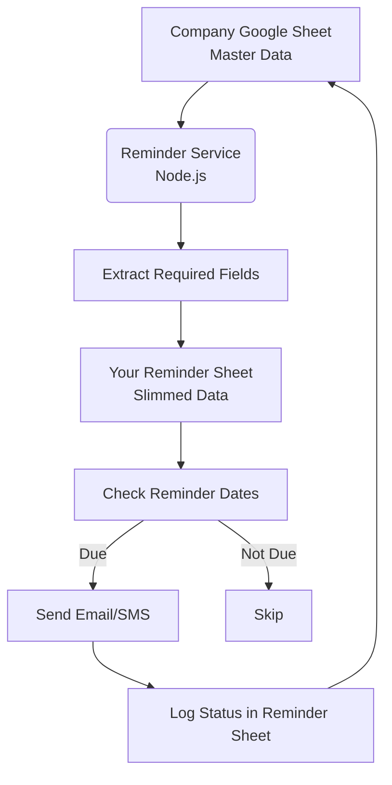

# ROYAL GEM AUTOCARE CUSTOMER REMINDER SYSTEM

## A lightweight customer reminder service built with Node.js (ESM) and Express. The service allows businesses to schedule and send reminders (e.g., appointment notifications, service updates, etc.) to customers.

--- 

## Features  
- Built with **ESM** (`"type": "module"`)  
- **Express.js** server for REST API endpoints  
- Reminder scheduling system  
- Modular notification channels (**SMS**, **Email**, **WhatsApp-ready**)  
- Easy integration with external APIs (Twilio, SendGrid, Nodemailer)  
- Extendable architecture for production 

### Tech Stack
- Node.js (ESM mode)
- Express.js
- Nodemailer / Twilio / SendGrid (depending on notification method)
- Cron Jobs / Node-Scheduler for scheduling

1. Fetch live company data

Get customer updates directly from the company’s Google Sheet online (not a local Excel copy).

The company`s sheet is the the master sheet

Detect new customers when they are added to the sheet.

2. Sync with my Reminder sheet

Copy all necessary customer data from the company (master) sheet into my Reminder Google Sheet (used for reminders).

Maintain only the required fields (name, plate number, contact, last service date, etc.).

3. Reminder date management

For each customer:

Calculate the next reminder date as 3 months after their last service date.

If a staff member manually updates a date in company`s (master) sheet, recalculate the next 3 months from that new  in the reminder date.

Always update the “next reminder date” field without overwriting other information in the master and reminder sheet.

4. Alphabetical arrangement

Keep all customers in the master sheet arranged alphabetically by name.

Ensure that details (plate number, phone, email, service date, etc.) stay correctly linked to the right customer.

5. Missing contact logging

If a customer has no email and no phone, log them into a separate column in the reminder anad master sheet (It should be called "Manual Contact")

This helps staff reach them manually.

6. Reminders

Use the calculated “next reminder date” to decide when to send reminders.

Deliver via:

Email (Nodemailer or SendGrid)

SMS (Twilio)

Log delivery status in a tracking sheet (It should be called "Staus Log") or database.

7. Non-intrusive updates

The code must only update/calculate the next reminder date and not change anything else in the master sheet.

8. Robustness

Handle new customers automatically.

Never mix up details when re-sorting alphabetically.

Always keep the master sheet consistent with the reminder sheet.