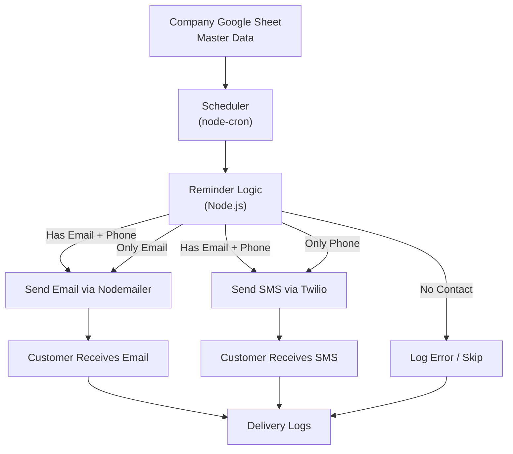

# ROYAL GEM AUTOCARE CUSTOMER REMINDER SYSTEM

## A lightweight customer reminder service built with Node.js (ESM) and Express. The service allows businesses to schedule and send reminders (e.g., appointment notifications, service updates, etc.) to customers.

--- 

## Features  
- Built with **ESM** (`"type": "module"`)  
- **Express.js** server for REST API endpoints  
- Reminder scheduling system  
- Modular notification channels (**SMS**, **Email**, **WhatsApp-ready**)  
- Easy integration with external APIs (Twilio, SendGrid, Nodemailer)  
- Extendable architecture for production 

### Tech Stack
- Node.js (ESM mode)
- Express.js
- Nodemailer / Twilio / SendGrid (depending on notification method)
- Cron Jobs / Node-Scheduler for scheduling

